---
theme:
    override:
        code:
            theme_name: halcyon
        default:
            colors:
                background: "10141c"
---
<!-- column_layout: [1,2] -->
<!-- column: 0 -->

<!-- jump_to_middle -->
# **Git intermedio**

Mitsiu Alejandro Carreño Sarabia
<!-- column: 1 -->


<!-- reset_layout -->


<!-- end_slide -->

# tree Temario
---
├── Intro   
│   ├── ¿Dónde está el mouse?   
│   └── ¿Qué significa el comando?   
├── Config   
│   ├── Configurar su editor de textos    
│   ├── PS1    
│   ├── user.name & user.email       
│   └── Autenticación SSH   
├── Basics   
│   ├── Git workflow (Read your outputs)    
│   └── Git for dummies (Cheatsheet)    
├── Malabares locales   
│   ├── git branch (Cheatsheet)   
│   ├── Stashing   
├── Malabares remotos   
│   └── Cherry-picking   
├── F&#42;ck ups   
│   ├── F&#42;ck up sencillo; mensaje de commit (--amend)   
│   ├── F&#42;ck up sencillo; Deshacer último commit (reset HEAD~)     
│   ├── F&#42;ck up; dificil; Subir a rama incorrecta (cherry-pick sin delete)    
│   ├── F&#42;ck up; dificil; Multiples errores en multiples commits (rebase -i)   
│   ├── Mega f&#42;ck up; crítico; Subir un PR mal (revert -m 1 SHA1)     
│   ├── Mega f&#42;ck up; F&#42;ck up en el fix de otro F&#42;ck up (reflog)     
│   └── Who f&#42;ck up?   
└── Pt. 2?   
&nbsp;&nbsp;&nbsp;&nbsp;├── git add -p   
&nbsp;&nbsp;&nbsp;&nbsp;├── Origins   
&nbsp;&nbsp;&nbsp;&nbsp;├── Submodules   
&nbsp;&nbsp;&nbsp;&nbsp;└── git rebase vs git merge (Qué/Cómo/Cuándo)    

<!-- end_slide -->

<!-- jump_to_middle -->
### Intro
---

<!-- end_slide -->

### Intro
#### Convenciones - Algunos slides dicen `EJERCICIO 0`
---

En la sección superior está marcado cuando hay un ejercicio relacionado al slide:
- Pueden clonar el repo pero no van a poder hacer push
- Pueden hacer fork y hacer push a su copia del repo 

Bloques de código, con highlight:
```bash {all|1|2-4|all}
$ git log --oneline # $ == comandos
3cf53b0 (HEAD -> UNA-10) feat: UNA-10 1 commit
70196b3 (main) Add filder struct and add titles
84e3445 (origin/main) Upload wip presentation
```
<!-- pause -->

Hasta abajo de mi pantalla hay dos cuadros ```"Slides"``` y ```"Terminal"``` el activo se marca en color verde

<!-- column_layout: [1,1] -->
<!-- column: 0 -->
Bloques de código ejecutables:
```bash +exec
# 🤖 : Este emoji es porque voy a ejecutar el 
# código dentro de la presentación
echo "Hola mundo"
```
<!-- column: 1 -->
```bash
# 🐱‍💻: Este otro emoji es porque voy a 
# ejecutar código en la pestaña "Terminal"
ps aux
```

<!-- reset_layout -->

<!-- end_slide -->
### Intro
#### ¿Dónde está el mouse?
---

En mi experiencia teclear es `más rápido` que usar el mouse.
* Misclicks
* Perder el puntero
* Arrastrar hasta el botón


    
Así que uso el teclado!
    
Pero ustedes usen lo que les hace sentir más cómodos, pueden `aprender a usar el teclado` o pueden explorar y `aprender y configurar su interfáz gráfica` de preferencia. 

<!-- end_slide -->
### Intro
#### ¿Qué significa el comando?
---

La fórmula general para cualquier comando de git es    
`git <command> <args>`      
cuando tengan dudas usen     
`git <command> --help` o usen [](https://git-scm.com/docs)

¿Cómo sé la fórmula general?
```bash
$ git --help
usage: git [-v | --version] [-h | --help] [-C <path>] [-c <name>=<value>]
           [--exec-path[=<path>]] [--html-path] [--man-path] [--info-path]
           [-p | --paginate | -P | --no-pager] [--no-replace-objects] [--bare]
           [--git-dir=<path>] [--work-tree=<path>] [--namespace=<name>]
           [--config-env=<name>=<envvar>] <command> [<args>]
```

Donde:
- [] = Un argumento/comando opcional 
- | = otra manera de llamar el mismo argumento/comando
- <> = algo variable

<!-- end_slide -->
### Intro
#### ¿Qué significa el comando?
---
```bash
$ git --help
usage: git [-v | --version] [-h | --help] [-C <path>] [-c <name>=<value>]
           [--exec-path[=<path>]] [--html-path] [--man-path] [--info-path]
           [-p | --paginate | -P | --no-pager] [--no-replace-objects] [--bare]
           [--git-dir=<path>] [--work-tree=<path>] [--namespace=<name>]
           [--config-env=<name>=<envvar>] <command> [<args>]
```

```bash +exec
🤖
# Ejecutando
git -v
# Es igual a 
git --version
```

🐱‍💻 Veamos el resultado completo de `git --help`

<!-- end_slide -->

<!-- jump_to_middle -->
### Config
---

<!-- end_slide -->

### Config
#### Configurar su editor de textos 
---
Primero es importante `configurar un editor de textos` con el que se sientan cómodos, puede ser de interfáz gráfica o de terminal.

Para configurar el editor pueden usar el siguiente comando reemplazando &lt;path&gt;:
   
**Nota: Esta opción cambia la configuración global (afecta a todos los repos)**
```bash
🐱‍💻
git config --global core.editor "<path>"
# Ejemplos:
git config --global core.editor "vim"
git config --global core.editor "nano"
git config --global core.editor "gnome-text-editor"
```

<!-- end_slide -->

### Config
#### Configurar Visual Studio Code
---

```bash
code --help
```

> if you do not see help, please follow these steps:
> - Mac: Type Shell Command: Install 'Code' command in path from the Command Palette.
> Command Palette is what pops up when you press shift + ⌘ + P while inside VS Code. (shift + ctrl + P in Windows)
> - Windows: Make sure you selected Add to PATH during the installation.
> - Linux: Make sure you installed Code via our new .deb or .rpm packages.
> 
> https://stackoverflow.com/a/36644561

```bash
# Visual studio code
git config --global core.editor "code --wait"
# O ruta completa
git config --global core.editor "<path/to/code> --wait"
```

<!-- end_slide -->

### Config
#### Configurar su editor de textos 
---
Verifiquemos nuestra configuración corriendo:

```bash
🐱‍💻
git config --global -e
```

<!-- end_slide -->

### Config
#### Configurar su editor de textos 
---
Extra: Podemos listar los archivos de configuración con:
```bash +exec
🤖
git config --list --show-origin
```

<!-- end_slide -->

### Config
#### PS1 
---
<!-- column_layout: [6, 1] -->
<!-- column: 0 -->
> The PS1 Shell Variable
> The PS1 shell variable defines the text printed before the blinking cursor in our terminal. 
> We may set a simple value like a single character, for example, $ or #. 
> On the other hand, we may set complex expressions 
> that are evaluated when the prompt is printed.
> 
> https://www.baeldung.com/linux/customize-bash-prompt
<!-- column: 1 -->

<!-- reset_layout -->

🐱‍💻

https://gist.github.com/mitsiu-carreno/b2ed36387ff4157f44002dda8bf81798#file-git-prompt-sh

> Credito: Shawn O. Pearce 

Linux

```bash
# Fedora (/etc/bashrc)
source ~/.git-prompt.sh
[ "$PS1" = "\\s-\\v\\\$ " ] && PS1="\u@\W\[\033[32m\]\$(__git_ps1)\[\033[00m\] $ "
```

<!-- end_slide -->

### Config
#### PS1 
---
Mac

```bash
source ~/.git-prompt.sh
# Mac (~/.bashrc)
export PS1="\u@\W\[\033[32m\]\$(__git_ps1)\[\033[00m\] $ "
```

Widows (WSL)

```bash
source ~/.git-prompt.sh
# WSL Linux (~/.bashrc)
PS1='${VIRTUAL_ENV:+($(basename $VIRTUAL_ENV)) }${debian_chroot:+($debian_chroot)}
\[\033[00m\]\u@\W\[\033[32m\]$(__git_ps1 " (%s)")\[\033[00m\] $ ';;
```


<!-- end_slide-->


### Config
#### user.name & user.email
---
Usualmente queremos tener nuestra `cuenta personal` separada de nuestra `cuenta de trabajo`


<!-- end_slide -->

### Config
#### user.name & user.email
---

Personalmente divido mis cosas del trabajo en una subcarpeta `*/designa/*`

```bash
$ tree -L 2 Documents/
Documents/
├── designa
│   ├── acuerdo-286
│   ├── administracion-usuarios-causanatura
│   ├── aprendizajes-para-todos
│   ├── avicola.app
│   ├── causa-natura-media
│   ├── database_backup
│   ├── devops
│   ├── privasol.mx
│   ├── servicios-escolares
│   └── ssh
├── dev_hell
│   ├── crunch-test
│   ├── cmake_tutorial
│   └── git-presentation
└── upa
    ├── oop
    └── plat_web
```


<!-- end_slide -->

### Config
#### user.name & user.email
---
<!-- column_layout: [2, 1] -->
<!-- column: 1 -->

<!-- column: 0 -->

Personalmente divido mis cosas del trabajo en una subcarpeta `*/designa/*`

~/.gitconfig
```bash {all|1-3|4-5|all} +line_numbers
[user]
  name = mitsiu-carreno
  email = mitsiu.carreno@gmail.com
[includeIf "gitdir:*/designa/"]
  path = .gitconfig.designa
[includeIf "gitdir:*/upa/"]
  path = .gitconfig.upa
[core]
  editor = vim
```
<!-- pause -->

~/.gitconfig.designa
```bash +line_numbers
[user]
  name = designa-mitsiu
  email = mitsiu.carreno@designamx.com
```

<!-- end_slide -->

### Config
#### Autenticación SSH
---

Finalmente es posible tener múltiples llaves ssh y asignar cada una a una cuenta de github, en este caso basado en una subcarpeta `*/designa/*` se referencía a la llave id_ed25519_designa

~/.ssh/config
```bash {all|1-2|4-5|all} +line_numbers
Match host github.com exec "[ $(pwd | egrep -ic 'designa') = 1 ]"
  IdentityFile ~/.ssh/id_ed25519_designa

Match host github.com exec "[ $(pwd | egrep -ic 'upa') = 1 ]"
  IdentityFile ~/.ssh/id_ed25519_upa

Host github.com
  IdentityFile ~/.ssh/id_ed25519
```

Para más información [](https://docs.github.com/en/authentication/connecting-to-github-with-ssh/generating-a-new-ssh-key-and-adding-it-to-the-ssh-agent)

<!-- end_slide -->

<!-- jump_to_middle -->
### Intro
---

<!--end_slide -->

### Basics
#### Git workflow (Read your outputs)
---


- **Working directory** => El área donde podemos `ver, crear, borrar, editar etc.` Git no da seguimiento de estos archivos `untracked files`

```bash {all|1|3-9|5|6|all}
$ touch new_file #Crear archivo nuevo

$ git status
On branch feature-1
Untracked files:
  (use "git add <file>..." to include in what will be committed)
    new_file

nothing added to commit but untracked files present (use "git add" to track)
```

<!--end_slide -->


### Basics
#### Git workflow (Read your outputs)
---


- **Working directory** => El área donde podemos `ver, crear, borrar, editar etc.` Git no da seguimiento de estos archivos `untracked files`

```bash {all|1|3-10|5|6-7,10|all}
$ echo "Modificar archivo commiteado" > modif_file # Agregar texto a archivo existente

$ git status
On branch feature-1
Changes not staged for commit:
  (use "git add <file>..." to update what will be committed)
  (use "git restore <file>..." to discard changes in working directory)
    modified:   modif_file

no changes added to commit (use "git add" and/or "git commit -a")
```

<!--end_slide -->

### Basics
#### Git workflow (Read your outputs)
---


- **Index/Staging** => El área en que git comienza a dar `seguimiento de los archivos y a guardar sus cambios`

```bash {all|1|4-8|5,7-8|6|all}
$ git add modif_file new_file

$ git status
On branch feature-1
Changes to be committed:
  (use "git restore --staged <file>..." to unstage)
    modified:   modif_file
    new file:   new_file
```

<!--end_slide -->

### Basics
#### Git workflow (Read your outputs)
---


- **HEAD** => Un `apuntador al commit más reciente de la rama actual`

<!-- pause -->

Pero... `¿Qué es un commit?`

<!--end_slide -->

### Basics
#### Git workflow (Read your outputs)
---

<!-- column_layout: [2,1] -->
<!-- column: 0 -->
- **HEAD** => Un `apuntador al commit más reciente de la rama actual`
- **Commit** => Comando para `capturar el estado` (index/stage) de punto en el tiempo

Imaginemos git como el juego adivina quién, con unas modificaciones...
<!-- column: 1 -->

<!-- reset_layout -->

<!-- pause -->
*En nuestra versión del juego primero movemos las fichas y luego preguntamos
- Cada pregunta es un mensaje de commit 
```bash
git commit -m'¿Tu personaje tiene barba?'
```
- Cada commit tiene asociado un cambio de estado 
```bash
git add bill
git rm sofie
```

<!--end_slide -->

### Basics
#### Git workflow (Read your outputs)
---

- **HEAD** => Un `apuntador al commit más reciente de la rama actual`
- **Commit** => Comando para `capturar el estado` (index/stage) de punto en el tiempo


<!--end_slide -->

### Basics
#### Git workflow (Read your outputs) `EJERCICIO 1`
---

- **HEAD** => Un `apuntador al commit más reciente de la rama actual`
- **Commit** => Comando para `capturar el estado` (index/stage) de punto en el tiempo

<!-- column_layout: [1,1] -->
<!-- column: 0 -->

**Agregar y commitear**  
```bash 


$ git add new_file
$ git commit -m'adding new file'
[feature-1 70f6e27] adding new file
 1 file changed, 0 insertions(+), 0 deletions(-)
 create mode 100644 new_file


$ git add modif_file
$ git commit -m'modif exist file'
[feature-1 dd574be] modif exist file
 1 file changed, 1 insertion(+)
```
<!-- column: 1 -->
**Historial de commits**
```bash 
$ git log --graph --oneline
* ecf4186 (HEAD -> feature-1) Setting up 


$ git log --graph --oneline
* 70f6e27 (HEAD -> feature-1) adding new file
* ecf4186 (origin/feature-1) seting up prev commit


$ git log --graph --oneline
* dd574be (HEAD -> feature-1) modif exist file
* 70f6e27 adding new file
* ecf4186 (origin/feature-1) seting up prev commit
```

<!-- reset_layout -->

<!--end_slide -->

### Basics
#### Git workflow (Read your outputs)
---


- **Remote repo** 

```bash {all|1|9|all}
$ git push origin feature-1
Enumerating objects: 7, done.
Counting objects: 100% (7/7), done.
Delta compression using up to 12 threads
Compressing objects: 100% (4/4), done.
Writing objects: 100% (5/5), 520 bytes | 520.00 KiB/s, done.
Total 5 (delta 0), reused 0 (delta 0), pack-reused 0 (from 0)
To github.com:mitsiu-carreno/git-interm-presentation.git
   ecf4186..dd574be  feature-1 -> feature-1
```

<!--end_slide -->

### Basics
#### Git for dummies (Cheatsheet)
---


<!--end_slide -->

### Basics
#### Git for dummies (Cheatsheet)
---


```bash +line_numbers
# Crear repo local
git init

# Clonar repo remoto
git clone <URL>

# Obtener el estatus actual del repositorio
git status

# Seguimiento de los cambios de un archivo 
git add <file1> <file2>

# Crear un nuevo commit y agregar un mensaje
git commit -m'<Descrip de cambios>'

# Obtener los cambios del repo remoto
git pull origin <branch>

# Subir cambios al repo remoto 
git push origin <branch>
```

*origin => remote name

<!-- end_slide -->

<!-- jump_to_middle -->
### Malabares locales
---

<!--end_slide -->

### Malabares locales
#### git branch (Cheatsheet)
---


```bash +line_numbers
# Crear una nueva rama, y cambiar el workspace
git checkout -b <new-branch>

# Mostrar todas las ramas locales y remotas
git branch --all

# Cambiar el directorio de trabajo a otra rama
git checkout <branch>

# Borrar rama local integrada a main 
# (con directorio de trabajo en otra rama)
git branch -d <rama>

# Borrar rama local no integrada a main
# (con directorio de trabajo en otra rama)
git branch -D <rama>

# Unir dos ramas (genera nuevo commit)
git merge <branch>

# Borrar rama remota 
git push origin --delete <branch>
```

*origin => remote name

<!-- end_slide -->

### Malabares locales
#### Stashing
---

Permite guardar los cambios del directorio de trabajo e index pero a la vez, permitiendo regresar a un directorio de trabajo limpio.

Casos de uso:
- Cambios necesarios en local que `nunca deben subirse al repo` remoto (.env, config individuales, código de depuración)
- Cambios locales momentáneamente irrelevantes para un fix urgente (queremos mantener los cambios sólo de manera local, pero `queremos un directorio de trabajo limpio para resolver un bug`)

```bash {all|3-5|6-9|10-12|all}
$ git status
On branch UNA-25
Changes to be committed:
  (use "git restore --staged <file>..." to unstage)
    new file:   test
Changes not staged for commit:
  (use "git add <file>..." to update what will be committed)
  (use "git restore <file>..." to discard changes in working directory)
    modified:   nginx.conf
Untracked files:
  (use "git add <file>..." to include in what will be committed)
    queries
```
<!-- end_slide -->

### Malabares locales
#### Stashing
---

Guardando en stash

```bash {1-5|7-13|15-19|all} 
$ # git stash
$ # git stash push 
$ # git stash push -- nginx.conf test
$ git stash -m"My new stash" -- test nginx.conf
Saved working directory and index state On UNA-25: My new stash

$ git status
On branch UNA-25
Untracked files:
  (use "git add <file>..." to include in what will be committed)
    queries

nothing added to commit but untracked files present (use "git add" to track) 

$ git stash list
stash@{0}: On UNA-25: My new stash
stash@{1}: WIP on UNA-18: 7ff5ee3 fix: UNA-18 Allow single questions be omitted
```
**Nota: El stash más reciente siempre tiene el índice 0**

<!-- end_slide -->

### Malabares locales
#### Stashing `EJERICIO 2`
---

Recuperado de stash

```bash {1-4|6-21|21|all} +line_numbers
$ git stash show 0
 nginx.conf | 1 +
 test       | 0
 2 files changed, 1 insertion(+)

$ git stash pop 0
On branch UNA-25
Changes to be committed:
  (use "git restore --staged <file>..." to unstage)
    new file:   test

Changes not staged for commit:
  (use "git add <file>..." to update what will be committed)
  (use "git restore <file>..." to discard changes in working directory)
    modified:   nginx.conf

Untracked files:
  (use "git add <file>..." to include in what will be committed)
    queries

Dropped refs/stash@{0} (a41ae5cabf5c0de873e2bd2b872984538e3c46aa)
```

<!-- end_slide -->

### Malabares locales
#### Stashing
---

> git stash --help [pop]
> Applying the state can fail with conflicts; in this case, it is not removed from the stash list. 
> You need to resolve the conflicts by hand and call git stash drop manually afterwards.

***Cuando tengan duda si recuperaron su stash correctamente**
```bash +line_numbers
git stash list
```

<!-- end_slide -->

<!-- jump_to_middle -->
### Malabares remotos
---

<!-- end_slide -->

### Malabares remotos
#### Cherry-picking 
---

Permite aplicar commits existentes en el directorio de trabajo actual.

Casos de uso:
- Hicieron y publicaron `(pushearon) commits en una rama equivocada.`
- Necesitan de manera urgente `cierto commit de otra rama (pero no toda la rama)` [ej, dependencia de una rama en progreso] 

**Importante: Por simplicidad, cuando decidan usar cherry-pick asegurense de que una de las dos siguientes condiciones se cumpla:**
- `La rama de donde copiaron los commits se va a borrar`
- `Los archivos relacionados al commit que copiaron no se van a modificar hasta que se merge con main o la rama de donde se copió`

<!-- end_slide -->

### Malabares remotos
#### Cherry-picking
---

Ejemplo: Se creó la rama incorrecta UNA-10 en lugar de UNA-11 **Nota:** Nadie está trabajando el issue UNA-10 por lo que se puede borrar, pero queremos rescatar el trabajo avanzado
<!-- column_layout: [1, 1] -->
<!-- column: 0 -->
Setup
```bash 
$ git log --oneline
531d90d (HEAD -> UNA-10) commit 4
2f0b408 commit 3
c8df2a7 commit 2
28eacf7 commit 1
70196b3 (main) Add filder struct and add titles
```

<!-- column: 1 -->

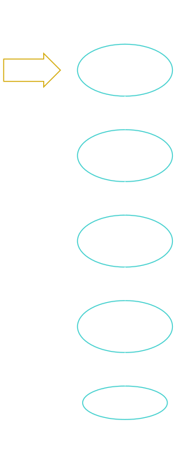
 
<!-- end_slide -->

### Malabares remotos
#### Cherry-picking
---

Ejemplo: Se creó la rama incorrecta UNA-10 en lugar de UNA-11 **Nota:** Nadie está trabajando el issue UNA-10 por lo que se puede borrar, pero queremos rescatar el trabajo avanzado
<!-- column_layout: [1, 1] -->
<!-- column: 0 -->
Setup
```bash 
# Regresamos a la rama principal (¿Por qué?)
$ git checkout main
# Actualizamos nuestra rama local (¿Por qué?)
$ git pull origin main
```

<!-- column: 1 -->
<!-- pause -->
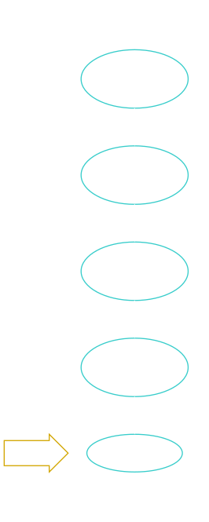
 
<!-- end_slide -->

### Malabares remotos
#### Cherry-picking
---

Ejemplo: Se creó la rama incorrecta UNA-10 en lugar de UNA-11 **Nota:** Nadie está trabajando el issue UNA-10 por lo que se puede borrar, pero queremos rescatar el trabajo avanzado
<!-- column_layout: [3, 1] -->
<!-- column: 0 -->
Setup
```bash
# Creamos la rama correcta
$ git checkout -b UNA-11
Switched to a new branch 'UNA-11'
$ git log --oneline
70196b3 (HEAD -> UNA-11, main) Add filder struct and add titles
```

<!-- column: 1 -->

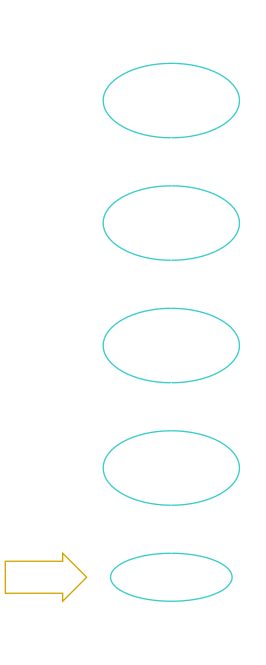
 
<!-- end_slide -->

### Malabares remotos
#### Cherry-picking
---

Ejemplo: Se creó la rama incorrecta UNA-10 en lugar de UNA-11 **Nota:** Nadie está trabajando el issue UNA-10 por lo que se puede borrar, pero queremos rescatar el trabajo avanzado
<!-- column_layout: [2, 1] -->
<!-- column: 0 -->
Setup
```bash
# Elegimos los commits a copiar a la nueva rama
$ git cherry-pick 28eacf7
[UNA-11 6f6b8d7] commit 1
 Date: Sat Mar 30 15:43:48 2024 -0600
 1 file changed, 0 insertions(+), 0 deletions(-)
 create mode 100644 git-interm/a

$ git log --oneline
6f6b8d7 (HEAD -> UNA-11) commit 1
70196b3 (main) Add filder struct and add titles
```
**Importante:** Noten que `generamos un nuevo commit`

<!-- column: 1 -->

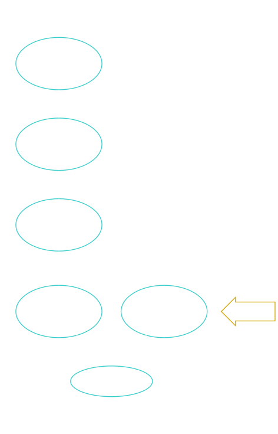
 
<!-- end_slide -->

### Malabares remotos
#### Cherry-picking
---

Ejemplo: Se creó la rama incorrecta UNA-10 en lugar de UNA-11 **Nota:** Nadie está trabajando el issue UNA-10 por lo que se puede borrar, pero queremos rescatar el trabajo avanzado
<!-- column_layout: [2, 1] -->
<!-- column: 0 -->
Setup
```bash
# Elegimos los commits a copiar a la nueva rama
$ git cherry-pick c8df2a7
[UNA-11 0292526] commit 2
 Date: Sat Mar 30 15:44:04 2024 -0600
 1 file changed, 0 insertions(+), 0 deletions(-)
 create mode 100644 git-interm/b

$ git cherry-pick 2f0b408
[UNA-11 e440696] commit 3
 Date: Sat Mar 30 15:44:13 2024 -0600
 1 file changed, 0 insertions(+), 0 deletions(-)
 create mode 100644 git-interm/c

$ git cherry-pick 531d90d
[UNA-11 5b033f9] commit 4
 Date: Sat Mar 30 15:44:22 2024 -0600
 1 file changed, 0 insertions(+), 0 deletions(-)
 create mode 100644 git-interm/d
```
**Importante:** Noten que `generamos un nuevo commit`

<!-- column: 1 -->

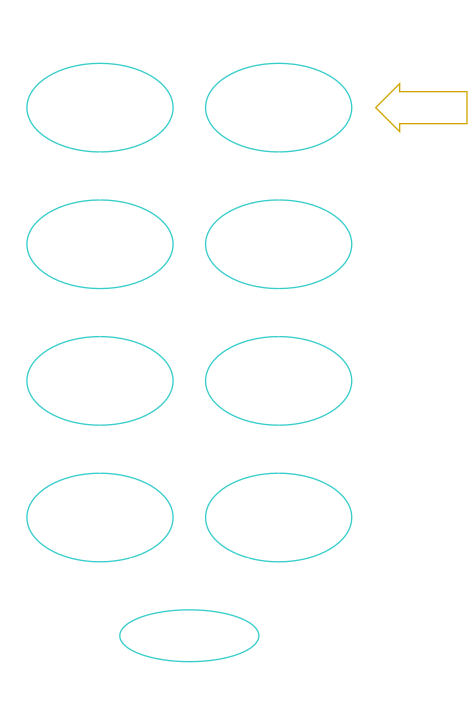
 
<!-- end_slide -->

### Malabares remotos
#### Cherry-picking `EJERCICIO 3`
---

Permite aplicar commits existentes en el directorio de trabajo actual.

**Importante: Dado que se crean nuevos commits idénticos a commits anteriores se debe tener cuidado de no generar conflictos:**
- `La rama de donde copiaron los commits se va a borrar`
- `Los archivos relacionados al commit que copiaron no se van a modificar hasta que se merge con main o la rama de donde se copió`
```bash
# Borrrar rama local
$ git checkout -D UNA-10
Deleted branch UNA-10 (was 531d90d)

# Borrar rama remota
$ git push origin --delete UNA-10
```

<!-- end_slide -->

### Malabares remotos
#### git rebase vs git merge (Qué/Cómo/Cuándo)
---

git-merge - Join two or more development histories together     
git-rebase - Reapply commits on top of another base tip     

Ambos comandos nos permiten integrar cambios entre dos ramas pero lo hacen de manera diferente.

Comencemos por merge que estamos familiarizados:

```bash
git init
touch a
git add a
git commit -m'main 1'
[master (root-commit) fe2058d] main 1
 1 file changed, 0 insertions(+), 0 deletions(-)
 create mode 100644 a

touch b
$ git add b
$ git commit -m'main 2'
[master 5bccf6f] main 2
 1 file changed, 0 insertions(+), 0 deletions(-)
 create mode 100644 b

git checkout -b merge-b
Switched to a new branch 'merge-b'
touch m-c
git add m-c
git commit -m'merge 1'
[merge-b a49858a] merge 1
 1 file changed, 0 insertions(+), 0 deletions(-)
 create mode 100644 m-c
$ touch m-d
$ git add m-d 
$ git commit -m'merge 2'
[merge-b 09f28ff] merge 2
 1 file changed, 0 insertions(+), 0 deletions(-)
 create mode 100644 m-d

git log --oneline
09f28ff (HEAD -> merge-b) merge 2
a49858a merge 1
5bccf6f (master) main 2
fe2058d main 1

#Adelantemos main (simulando que otro colaborador hizo merge)
touch c 
$ git add c
$ git commit -m'main 3'
[master 1340a20] main 3
 1 file changed, 0 insertions(+), 0 deletions(-)
 create mode 100644 c
$ git log --oneline
1340a20 (HEAD -> master) main 3
5bccf6f main 2
fe2058d main 1
$ git pull origin master

$ git checkout merge-b
Switched to branch 'merge-b'

```
```bash
Merge branch 'master' into merge-b
# Please enter a commit message to explain why this merge is necessary,
# especially if it merges an updated upstream into a topic branch.
#
# Lines starting with '#' will be ignored, and an empty message aborts
# the commit.

git merge master
Merge made by the 'ort' strategy.
 c | 0
 1 file changed, 0 insertions(+), 0 deletions(-)
 create mode 100644 c

$ git log --oneline
0b8851e (HEAD -> merge-b) Merge branch 'master' into merge-b
1340a20 (master) main 3
09f28ff merge 2
a49858a merge 1
5bccf6f main 2
fe2058d main 1
```

<!-- end_slide -->

<!-- jump_to_middle -->
### F&#42;ck ups
Los f&#42;ck ups sencillos son aquellos que son locales, una vez que se suben al repo remoto se debe `tener sensibilidad sobre el riesgo de que alguien haya descargado los cambios a su repositorio remoto.`

Parecido al comando cherry-pick, estos comandos `literalmente están cambiando la historia (commits nuevos que sustituyen a commits viejos).`

<!-- end_slide -->

### F&#42;ck ups
#### F&#42;ck up sencillo; mensaje de commit (--amend) `EJERCICIO 4` 
---
Dada la integración de semantic release [](https://github.com/semantic-release/commit-analyzer?tab=readme-ov-file#default-rules-matching) que usamos en los proyectos, los mensajes de commit deben tener un formato específico para generar una nueva versión a deployar.

<!-- column_layout: [2,1] -->
<!-- column: 0 -->
```bash {all|1-7|9-18|all}
$ git commit -m'arreglar archivo'
[main (root-commit) 397c847] arreglar archivo
 1 file changed, 0 insertions(+), 0 deletions(-)
 create mode 100644 a

$ git log --oneline
397c847 (HEAD -> main) arreglar archivo

$ git commit --amend -m "fix: UNA-10 arreglar archivo"
[main f35029d] fix: UNA-10 arreglar archivo
 Date: Sun Mar 31 21:25:32 2024 -0600
 1 file changed, 0 insertions(+), 0 deletions(-)
 create mode 100644 a

$ git log --oneline
f35029d (HEAD -> main) fix: UNA-10 arreglar archivo

$ git push origin UNA-10
```
<!-- column: 1 -->

Aspectos a considerar:
- Estamos generando nuevos commits (`sustituyendo historia`) por lo que si el commit ya fue pusheado esta solución solo se debe emplear si estamos seguros que nadie ha descargado el primer commit (397c847).
- Amend `solo funciona para el último commit` (el más reciente)

<!-- reset_layout -->

<!-- end_slide -->

### F&#42;ck ups
#### F&#42;ck up sencillo; Deshacer último commit (reset) 
---

Hay situaciones en las que acabamos de hacer un commit solo para darnos cuenta que faltó hacer algún otro cambio, o falto agregar otro archivo.


**Set up**
<!-- column_layout: [1,1] -->
<!-- column: 0 -->

```bash
git add a && git commit -m'1 +a'
[main (root-commit) ab641d8] 1 +a
 1 file changed, 0 insertions(+), 0 deletions(-)
 create mode 100644 a
$ git add b && git commit -m'2 +b'
[main e940ab8] 2 +b
 1 file changed, 0 insertions(+), 0 deletions(-)
 create mode 100644 b
$ git add c && git commit -m'3 +c'
[main 757a605] 3 +c
 1 file changed, 0 insertions(+), 0 deletions(-)
 create mode 100644 c
$ git add d && git commit -m'4 +d'
[main 7087d5d] 4 +d
 1 file changed, 0 insertions(+), 0 deletions(-)
 create mode 100644 d
```
<!-- column: 1 -->

```bash
$ git add e && git commit -m'5 +e'
[main 21ae9ea] 5 +e
 1 file changed, 0 insertions(+), 0 deletions(-)
 create mode 100644 e


$ git log --oneline
21ae9ea (HEAD -> main) 5 +e
7087d5d 4 +d
757a605 3 +c
e940ab8 2 +b
ab641d8 1 +a
```
<!-- reset_layout -->

<!-- end_slide -->

### F&#42;ck ups
#### F&#42;ck up sencillo; Deshacer último commit (reset)
---
Es posible deshacer los últimos n commits:

<!-- column_layout: [1,1] -->
<!-- column: 0 -->
- Regresando los archivos a index `git reset HEAD~`
```bash
$ git reset HEAD~

$ git status
On branch main
Untracked files:
  (use "git add <file>..." [...]) 
    e

nothing added to commit but untracked files present
$ git log --oneline
7087d5d (HEAD -> main) 4 +d
757a605 3 +c
e940ab8 2 +b
ab641d8 1 +a
```

<!-- column: 1 -->
- Descartando completamente el último commit `git reset HEAD~ --hard` (el archivo d no está en el working dir)

```bash
# Descartar completamente el último commit
$ git reset HEAD~ --hard
HEAD is now at 757a605 3 +c
$ git status
On branch main
Untracked files:
  (use "git add <file>..." [...])
    e

nothing added to commit but untracked files present
$ git log --oneline
757a605 (HEAD -> main) 3 +c
e940ab8 2 +b
ab641d8 1 +a
```
<!-- reset_layout -->

<!-- end_slide -->

### F&#42;ck ups
#### F&#42;ck up sencillo; Deshacer último commit (reset) `EJERCICIO 5`
---

Para descartar mutliples commits basta con especificar cuantos commits detrás de HEAD `git reset HEAD~2` (afecta los últimos dos commits)

```bash
$ git reset HEAD~2
$ git status
On branch main
Untracked files:
  (use "git add <file>..." [...])
    b
    c
    e

nothing added to commit but untracked files present
$ git log --oneline
ab641d8 (HEAD -> main) 1 +a
```

<!-- end_slide -->

### F&#42;ck ups
#### F&#42;ck up; dificil; Subir a rama incorrecta (cherry-pick sin delete)
---

Muy similar al ejemplo de cherry-pick, pero qué pasa si no podemos borrar la rama incorrecta (por ejemplo es otra rama que alguien activamente está trabajando)

<!-- column_layout: [1,1] -->
<!-- column: 0 -->

```bash
git log --oneline
4edb9d2 (HEAD -> UNA-10) c11  # Rama incorrecta
a5bef5f c10                   # Rama correcta
ff33b1f b11                   # Rama incorrecta
e54f3f2 b10                   # Rama correcta
d53515f a11                   # Rama incorrecta
1bf9731 a10                   # Rama correcta
a6a7c9c (main) main 1 +a      # Main
```
<!-- column: 1 --> 
```bash
$ git checkout main

$ git checkout -b UNA-11
Switched to a new branch 'UNA-11'

$ git cherry-pick d53515f ff33b1f 4edb9d2
[UNA-11 908ed17] a11
 Date: Tue Apr 2 11:38:11 2024 -0600
 1 file changed, 0 insertions(+), 0 deletions(-)
 create mode 100644 a11
[UNA-11 ab582cd] b11
 Date: Tue Apr 2 11:39:02 2024 -0600
 1 file changed, 0 insertions(+), 0 deletions(-)
 create mode 100644 b11
[UNA-11 41df64b] c11
 Date: Tue Apr 2 11:39:28 2024 -0600
 1 file changed, 0 insertions(+), 0 deletions(-)
 create mode 100644 c11

```
<!-- reset_layout -->

<!-- end_slide -->

### F&#42;ck ups
#### F&#42;ck up; dificil; Subir a rama incorrecta (cherry-pick sin delete)
---

Muy similar al ejemplo de cherry-pick, pero qué pasa si no podemos borrar la rama incorrecta (por ejemplo es otra rama que alguien activamente está trabajando)

<!-- column_layout: [1,1] -->
<!-- column: 0 -->
```bash
$ git checkout UNA-10
Switched to branch 'UNA-10'

$ git revert d53515f ff33b1f 4edb9d2

This reverts commit 
     d53515ff4efcfbf2ba3c7a6c95c0492c60b5b616.

# Please enter the commit message for your changes
# Lines starting with '#' will be ignored, 
# and an empty message aborts the commit.
#
# On branch UNA-10
# Revert currently in progress.
#
# Changes to be committed:
#   deleted:    a11
#
```

<!-- column: 1 -->

```bash
git revert d53515f ff33b1f 4edb9d2
[UNA-10 caaac7a] Revert "a11"
 1 file changed, 0 insertions(+), 0 deletions(-)
 delete mode 100644 a11
[UNA-10 288afd4] Revert "b11"
 1 file changed, 0 insertions(+), 0 deletions(-)
 delete mode 100644 b11
[UNA-10 c5ba190] Revert "c11"
 1 file changed, 0 insertions(+), 0 deletions(-)
 delete mode 100644 c11

```
<!-- reset_layout -->

<!-- end_slide -->

### F&#42;ck ups
#### F&#42;ck up; dificil; Subir a rama incorrecta (cherry-pick sin delete) `EJERCICIO 6`
---

Muy similar al ejemplo de cherry-pick, pero qué pasa si no podemos borrar la rama incorrecta (por ejemplo es otra rama que alguien activamente está trabajando)

```bash
$ git log --oneline
c5ba190 (HEAD -> UNA-10) Revert "c11"
288afd4 Revert "b11"
caaac7a Revert "a11"
4edb9d2 c11
a5bef5f c10
ff33b1f b11
e54f3f2 b10
d53515f a11
1bf9731 a10
a6a7c9c (main) main 1 +a

$ git checkout main
$ git merge UNA-11
$ git merge UNA-10
```
<!-- end_slide -->

### F&#42;ck ups
#### F&#42;ck up; dificil; Multiples errores en multiples commits (rebase -i)   
---

Regresando al setup anterior, pero ahora imaginemos que el error es distinto, todos los commits pertenecen a la rama pero olvidamos poner "fix: UNA-10" a todos nuestros commits

```bash 
git log --oneline
4edb9d2 (HEAD -> UNA-10) c11
a5bef5f c10                  
ff33b1f b11                 
e54f3f2 b10                
d53515f a11               
1bf9731 a10              
a6a7c9c (main) main 1 +a


$ git rebase -i HEAD~6
```
<!-- end_slide -->

### F&#42;ck ups
#### F&#42;ck up; dificil; Multiples errores en multiples commits (rebase -i)   
---

`git rebase -i HEAD~<n>` Abre el editor de texto y nos permite realizar cualquiera de las siguientes operaciones: 

```bash
$ git rebase -i HEAD~6
# Commands:
# p, pick <commit> = use commit
# r, reword <commit> = use commit, but edit the commit message
# e, edit <commit> = use commit, but stop for amending
# s, squash <commit> = use commit, but meld into previous commit
# f, fixup [-C | -c] <commit> = like "squash" but keep only the previous
#                    commit's log message, unless -C is used, in which case
#                    keep only this commit's message; -c is same as -C but
#                    opens the editor
# x, exec <command> = run command (the rest of the line) using shell
# b, break = stop here (continue rebase later with 'git rebase --continue')
# d, drop <commit> = remove commit
# l, label <label> = label current HEAD with a name
# t, reset <label> = reset HEAD to a label
# m, merge [-C <commit> | -c <commit>] <label> [# <oneline>]
#         create a merge commit using the original merge commit's
#         message (or the oneline, if no original merge commit was
#         specified); use -c <commit> to reword the commit message
# u, update-ref <ref> = track a placeholder for the <ref> to be updated
#                       to this position in the new commits. The <ref> is
#                       updated at the end of the rebase
```


<!-- end_slide -->

### F&#42;ck ups
#### F&#42;ck up; dificil; Multiples errores en multiples commits (rebase -i)   
---

En nuestra situación queremos cambiar el mensaje del commit (`reword`) `primero debemos indicar la operación a realizar`

**Noten que los commits están ordenados comenzando por el más antiguo**

<!-- column_layout: [1,1] -->
<!-- column: 0 -->

```bash
$ git rebase -i HEAD~6
pick 1bf9731 a10
pick d53515f a11
pick e54f3f2 b10
pick ff33b1f b11
pick a5bef5f c10
pick 4edb9d2 c11
```
<!-- column: 1 -->

```bash
$ git rebase -i HEAD~6
reword 1bf9731 a10
reword d53515f a11
reword e54f3f2 b10
reword ff33b1f b11
reword a5bef5f c10
reword 4edb9d2 c11
```
<!-- reset_layout -->

Guardamos y cerramos el editor

<!-- end_slide -->

### F&#42;ck ups
#### F&#42;ck up; dificil; Multiples errores en multiples commits (rebase -i)   
---

A continuación se abrirá el editor de textos para `escribir el nuevo mensaje del commit`, además de mostrar el contexto del commit.

```bash
fix: UNA-10 a10

# Please enter the commit message for your changes. Lines starting
# with '#' will be ignored, and an empty message aborts the commit.
#
# Date:      Tue Apr 2 11:37:33 2024 -0600
#
# interactive rebase in progress; onto a6a7c9c
# Last command done (1 command done):
#    reword 1bf9731 a10
# Next commands to do (5 remaining commands):
#    reword d53515f a11
#    reword e54f3f2 b10
# You are currently editing a commit while rebasing branch 'UNA-10' on 'a6a7c9c'.
#
# Changes to be committed:
#	new file:   a10
#
```

Esta operación se repetirá para cada commit seleccionado

<!-- end_slide -->

### F&#42;ck ups
#### F&#42;ck up; dificil; Multiples errores en multiples commits (rebase -i) `EJERCICIO 7`   
---

Finalmente queda resaltar que esta operación `reescribe la historia al generar nuevos commit` así que usenla de manera apropiada

<!-- end_slide -->

### F&#42;ck ups
#### Mega f&#42;ck up; crítico; Subir un PR mal (revert -m 1 SHA1)
---

You know when you fuck something up and you wish you had the power to hit undo?
<!-- pause -->
Like when you say the dumbest thing in front of your biggest crush
<!-- pause -->
**Or when you push a commit that undoes your boss work, and it gets approved and merged into main?**
We all have those days, but today is not going to be one of them.

<!-- column_layout: [1,2] -->
<!-- column: 0 -->

**Anecdota time!**   
1  Por casualidad ví que mi cambio mío aprobado unos días antes se había borrado  

<!-- column: 1 -->
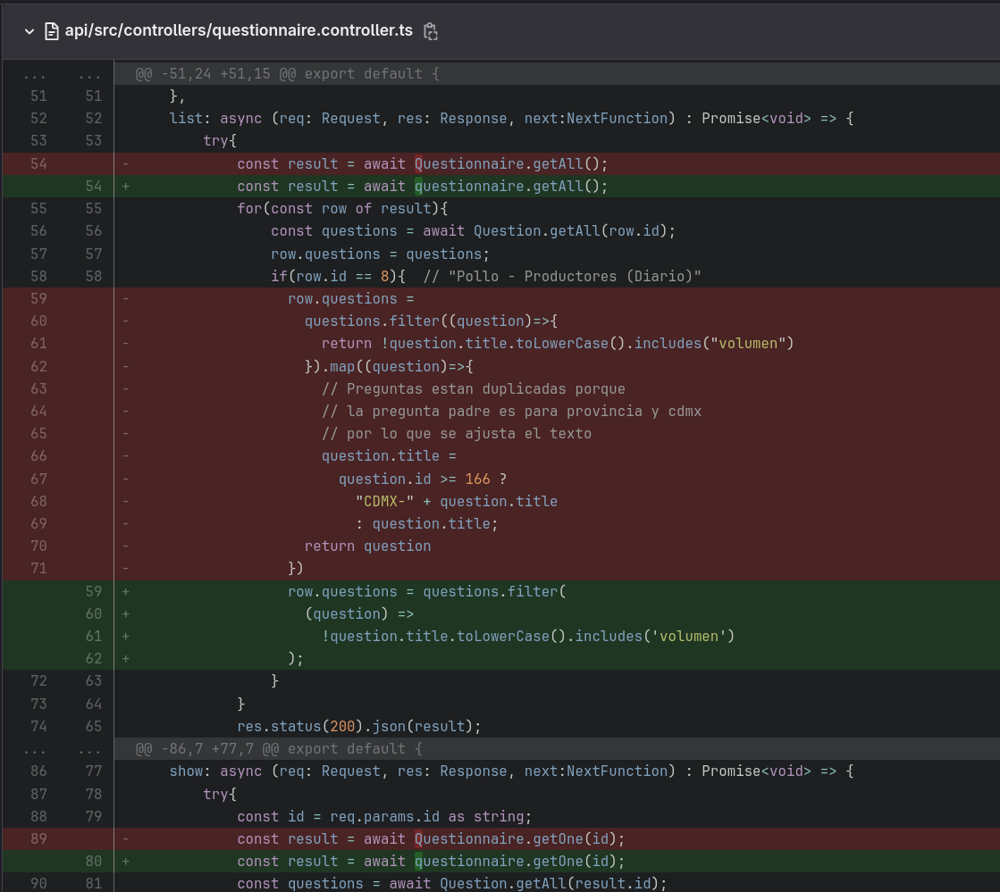

<!-- reset_layout -->

<!-- end_slide -->

### F&#42;ck ups
#### Mega f&#42;ck up; crítico; Subir un PR mal (revert -m 1 SHA1)
---

2  Y este no era un PR pequeño... 

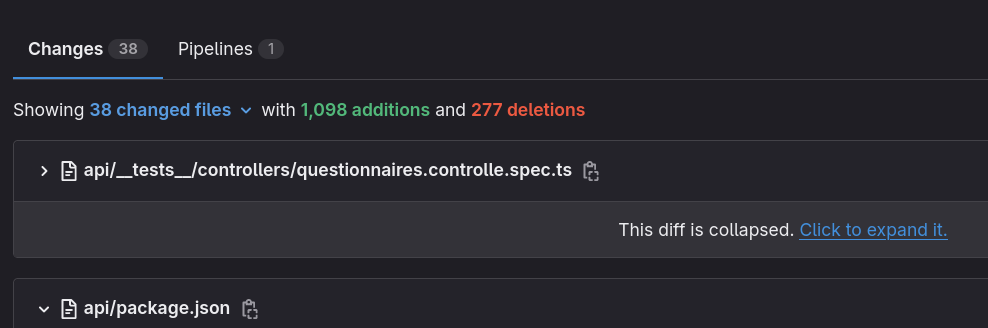

3  Por una parte me urgía hacer deploy, pero por otra, ese PR era demasiado grande como para revisarlo apropiadamente.

<!-- end_slide -->

### F&#42;ck ups
#### Mega f&#42;ck up; crítico; Subir un PR mal (revert -m 1 SHA1)
---

```bash
$ git revert -m 1 <SHA1>
```

<!-- column_layout: [1,1] -->
<!-- column: 0 -->

<!-- column: 1 -->
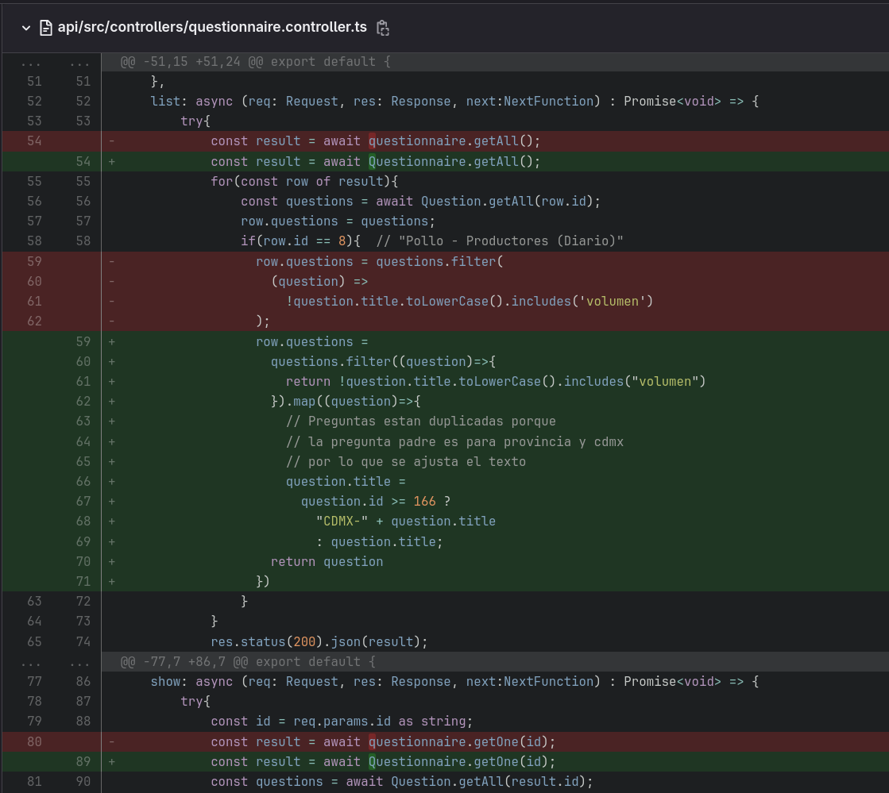
<!-- reset_layout -->

<!-- end_slide -->

### F&#42;ck ups
#### Mega f&#42;ck up; crítico; Subir un PR mal (revert -m 1 SHA1)
---

Revert no cambia los commits históricos, aún se podía preservar los cambios para una mejor revisión posterior, pero ya no estaban en main

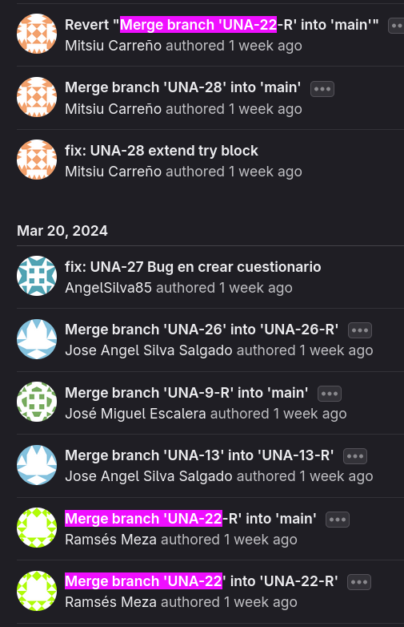
<!-- end_slide -->

### F&#42;ck ups
#### Mega f&#42;ck up; F&#42;ck up en el fix de otro F&#42;ck up (reflog) `EJERCICIO 8`
---

Con reflog podemos `regresar operaciones destructivas` como reset, rebase

```
$ git reflog
c0d6242 (HEAD -> UNA-10) HEAD@{0}: rebase (finish): returning to refs/heads/UNA-10
c0d6242 (HEAD -> UNA-10) HEAD@{1}: rebase (pick): c10
bbd3e90 HEAD@{2}: rebase (pick): b10
1bf9731 HEAD@{3}: rebase (start): checkout HEAD~6
4edb9d2 HEAD@{4}: rebase (finish): returning to refs/heads/UNA-10
4edb9d2 HEAD@{5}: rebase (start): checkout HEAD~6
4edb9d2 HEAD@{6}: commit: c11
a5bef5f HEAD@{7}: commit: c10
ff33b1f HEAD@{8}: commit: b11
e54f3f2 HEAD@{9}: commit: b10
d53515f HEAD@{10}: commit: a11
1bf9731 HEAD@{11}: commit: a10
a6a7c9c (main) HEAD@{12}: checkout: moving from main to UNA-10
a6a7c9c (main) HEAD@{13}: commit (initial): main 1 +a
$ git reset --hard HEAD@{4}
HEAD is now at 4edb9d2 c11
```
<!-- end_slide -->

### F&#42;ck ups
#### Who f&#42;ck up?
---
Finalmente...

A veces veo código tan feo que necesito ponerle una cara, otras veces me sirve entender el contexto de cierta línea de código para entender mejor qué está haciendo o porqué se hizo así. Si se encuentran en una situación similar pueden usar:

```
# git log -L <start_line>,<end_line>:path/to/file
git log -L 12,15:api/src/controllers/users.controller.ts
```

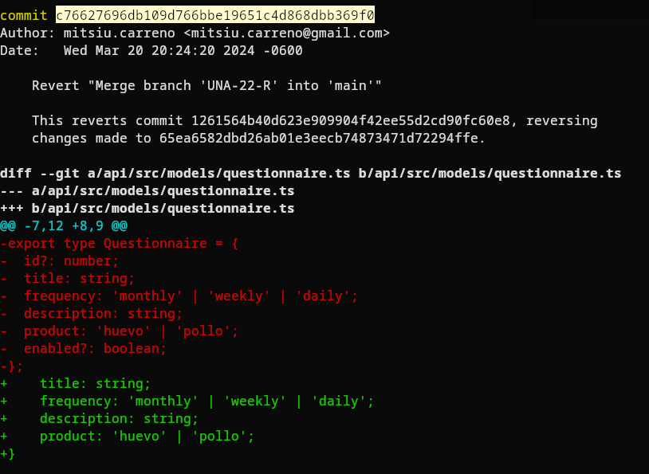

Copiamos el SHA1 (c76627696db109d766bbe19651c4d868dbb369f0)

<!-- end_slide -->

### F&#42;ck ups
#### Who f&#42;ck up?
---
En el repo remoto abrimos cualquier commit

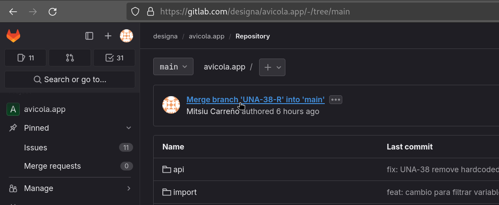

<!-- end_slide -->

### F&#42;ck ups
#### Who f&#42;ck up?
---


Y reemplazamos el SHA1 en la url

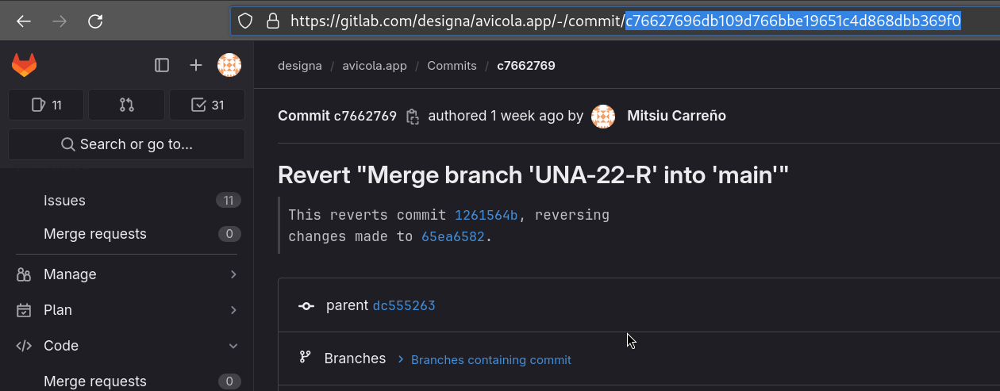

<!-- end_slide -->

### Summary
#### Cheatsheet
---

<!-- column_layout: [1,1] -->
<!-- column: 0 -->
```bash
# Ver resumen de commits 
git log <--oneline>

# Stash create
git stash 
git stash push

# Stash create with message
git stash -m"Message" < -- file1 file 2>
git stash push < -- file1 file2>

# Stash list
git stash list

# Stash examinar entrada
git stash show <n>

# Stash pop
git stash pop <n>
```

<!-- column: 1 -->

```bash
# Cherry-pick 
git cherry-pick [ commits ]

# Descartar commit 
git reset <--hard> HEAD~<n>

# Nuevo commit contrario
git revert [ commits ]

# Nuevo commit contrario a merge
git revert -m 1 <commit>

# Editar multiples commits
git rebase -i HEAD~<n>

# Commits de sección de archivo
git log -L start,end:path

# Reescribir historia
git push --force-with-lease
```

<!-- reset_layout -->

<!-- end_slide -->

<!-- column_layout: [1,3] -->
<!-- column: 0 -->

<!-- jump_to_middle -->
## Gracias

<!-- column: 1 -->


<!-- reset_layout -->

<!-- end_slide -->
