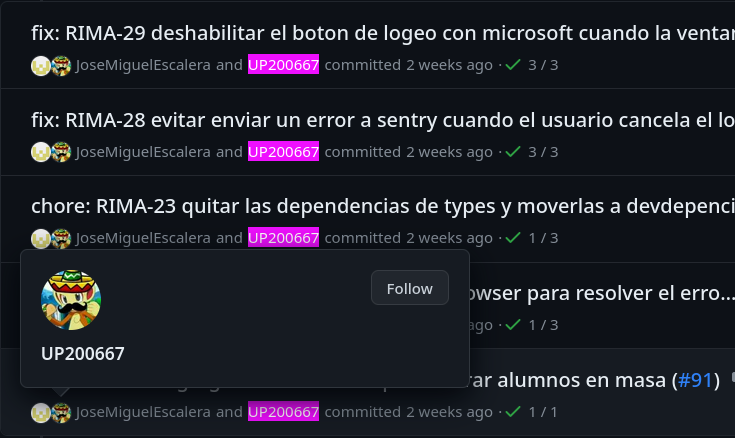

# tree Temario
---
├── Intro   
│   ├── ¿Dónde esta el mouse?   
│   └── ¿Qué significa el comando?   
├── Config   
│   ├── Configurar su editor de textos    
│   ├── PS1    
│   ├── Configurar username / email       
│   └── Autenticación SSH   
├── Basics   
│   ├── Git workflow (Read your outputs)    
│   └── Git for dummies (Cheatsheet)    
├── Malabares locales   
│   ├── git branch   
│   ├── Stashing   
├── Malabares remotos   
│   ├── Cherry-picking   
│   └── git rebase vs git merge (Qué/Cómo/Cuándo)    
├── F*ck ups   
│   ├── F*ck up sencillo (--amend)   
│   ├── F*ck up sencillo (git reset HEAD~1)   
│   ├── F*ck up intermedio (subir a *-R) [modo fácil] (cherry-pick & delete branch)   
│   ├── F*ck up intermedio (subir a *-R) [modo difícil](??)    
│   ├── F*ck up complicado (rebase -i)   
│   ├── Mega f*ck up (subir algo mal)   Agregar git revert y git revert -m 1 SHA1     
│   └── Who f*ck up?   
└── Extras   
    â”œâ”€â”€ git add -p   
    â”œâ”€â”€ Origins   
    â””── Submodules   

<!-- end_slide -->
### Intro
#### ¿Dónde esta el mouse?
---

En mi experiencia teclear es `más rápido` que usar el mouse.
* Misclicks
* Perder el puntero
* Arrastrar hasta el botón


    
Así que uso el teclado!
    
Pero ustedes usen lo que les hace sentir más comodos, pueden `aprender a usar el teclado` o pueden explorar y `aprender y configurar su interfaz gráfica` de preferencia. 

<!-- end_slide -->
### Intro
#### ¿Qué significa el comando?
---

La formula general para cualquier comando de git es    
`git <command> <args>`      
cuando tengan dudas usen     
`git <command> --help` o usen [](https://git-scm.com/docs)

¿Cómo sé la formula general?
```bash
$ git --help
usage: git [-v | --version] [-h | --help] [-C <path>] [-c <name>=<value>]
           [--exec-path[=<path>]] [--html-path] [--man-path] [--info-path]
           [-p | --paginate | -P | --no-pager] [--no-replace-objects] [--bare]
           [--git-dir=<path>] [--work-tree=<path>] [--namespace=<name>]
           [--config-env=<name>=<envvar>] <command> [<args>]
```

Donde:
- [] = Un argumento/comando opcional 
- | = otra manera de llamar el mismo argumento/comando
- <> = algo variable

<!-- end_slide -->
### Intro
#### ¿Qué significa el comando?
---
```bash
$ git --help
usage: git [-v | --version] [-h | --help] [-C <path>] [-c <name>=<value>]
           [--exec-path[=<path>]] [--html-path] [--man-path] [--info-path]
           [-p | --paginate | -P | --no-pager] [--no-replace-objects] [--bare]
           [--git-dir=<path>] [--work-tree=<path>] [--namespace=<name>]
           [--config-env=<name>=<envvar>] <command> [<args>]
```

```bash +exec
🤖
# Ejecutando
git -v
# Es igual a 
git --version
```

🐱‍💻 Veamos el resultado completo de `git --help`

<!-- end_slide -->

### Config
#### Configurar su editor de textos 
---
Primero es importante `configurar un editor de textos` con el que se sientan cómodos, puede ser de interfáz gráfica o de terminal.

Para configurar el editor pueden usar el siguiente comando remplazando &lt;path&gt;:
   
**Nota: Esta opción cambia la configuración global (afecta a todos los repos)**
```bash
🐱‍💻
git config --global core.editor "<path>"
# Ejemplos:
git config --global core.editor "vim"
git config --global core.editor "nano"
git config --global core.editor "gnome-text-editor"
```

<!-- end_slide -->

### Config
#### Configurar Visual Studio Code
---

```bash
code --help
```

> if you do not see help, please follow these steps:
> - Mac: Type Shell Command: Install 'Code' command in path from the Command Palette.
> Command Palette is what pops up when you press shift + ⌘ + P while inside VS Code. (shift + ctrl + P in Windows)
> - Windows: Make sure you selected Add to PATH during the installation.
> - Linux: Make sure you installed Code via our new .deb or .rpm packages.
> 
> https://stackoverflow.com/a/36644561

```bash
# Visual studio code
git config --global core.editor "code --wait"
# O ruta completa
git config --global core.editor "<path/to/code> --wait"
```

<!-- end_slide -->

### Config
#### Configurar su editor de textos 
---
Verifiquemos nuestra configuración corriendo:

```bash
🐱‍💻
git config --global -e
```

<!-- end_slide -->

### Config
#### Configurar su editor de textos 
---
Extra: Podemos listar los archivos de configuración con:
```bash +exec
🤖
git config --list --show-origin
```
**Nota: De tarea corran este comando dentro/fuera de un repositorio de git, ¿Qué cambia?**

<!-- end_slide -->

### Config
#### PS1 
---
<!-- column_layout: [6, 1] -->
<!-- column: 0 -->
> The PS1 Shell Variable
> The PS1 shell variable defines the text printed before the blinking cursor in our terminal. 
> We may set a simple value like a single character, for example, $ or #. 
> On the other hand, we may set complex expressions 
> that are evaluated when the prompt is printed.
> 
> https://www.baeldung.com/linux/customize-bash-prompt
<!-- column: 1 -->

<!-- reset_layout -->

🐱‍💻

https://gist.github.com/mitsiu-carreno/b2ed36387ff4157f44002dda8bf81798#file-git-prompt-sh

> Credito: Shawn O. Pearce 

Linux

```bash
# Fedora (/etc/bashrc)
source ~/.git-prompt.sh
[ "$PS1" = "\\s-\\v\\\$ " ] && PS1="\u@\W\[\033[32m\]\$(__git_ps1)\[\033[00m\] $ "
```

<!-- end_slide -->

### Config
#### PS1 
---
Mac

```bash
source ~/.git-prompt.sh
# Mac (~/.bashrc)
export PS1="\u@\W\[\033[32m\]\$(__git_ps1)\[\033[00m\] $ "
```

Widows (WSL)

```bash
source ~/.git-prompt.sh
# WSL Linux (~/.bashrc)
PS1='${VIRTUAL_ENV:+($(basename $VIRTUAL_ENV)) }${debian_chroot:+($debian_chroot)}
\[\033[00m\]\u@\W\[\033[32m\]$(__git_ps1 " (%s)")\[\033[00m\] $ ';;
```


<!-- end_slide-->


### Config
#### user.name & user.email
---
Usualmente queremos tener nuestra `cuenta personal` separada de nuestra `cuenta de trabajo`


<!-- end_slide -->

### Config
#### user.name & user.email
---
<!-- column_layout: [2, 1] -->
<!-- column: 1 -->

<!-- column: 0 -->

Personalmente divido mis cosas del trabajo en una subcarpeta `*/designa/`

~/.gitconfig
```bash {all|1-3|4-5|all} +line_numbers
[user]
  name = mitsiu-carreno
  email = mitsiu.carreno@gmail.com
[includeIf "gitdir:*/designa/"]
  path = .gitconfig.designa
[core]
  editor = vim
```
<!-- pause -->

~/.gitconfig.designa
```bash +line_numbers
[user]
  name = designa-mitsiu
  email = mitsiu.carreno@designamx.com
```

<!-- end_slide -->

### Config
#### Autenticación SSH
---

Finalmente es posible tener multiples llaves ssh y asignar cada una a una cuenta de github, en este caso basado en una subcarpeta `*/upa/` se referencía a la llave id_ed25519_upa

~/.ssh/config
```bash {all|1-2|4-5|all} +line_numbers
Match host github.com exec "[ $(pwd | egrep -ic 'upa') = 1 ]"
  IdentityFile ~/.ssh/id_ed25519_upa

Host github.com
  IdentityFile ~/.ssh/id_ed25519
```

Para más información [](https://docs.github.com/en/authentication/connecting-to-github-with-ssh/generating-a-new-ssh-key-and-adding-it-to-the-ssh-agent)

<!--end_slide -->

### Basics
#### Git workflow (Read your outputs)
---


- **Working directory** => El área donde podemos `ver, crear, borrar, editar etc.` Git no da seguimiento de estos archivos `untracked files`

```bash {all|1|3-9|5|6|all}
$ touch new_file #Crear archivo nuevo
$ 
$ git status
On branch feature-1
Untracked files:
  (use "git add <file>..." to include in what will be committed)
	new_file

nothing added to commit but untracked files present (use "git add" to track)
```

<!--end_slide -->


### Basics
#### Git workflow (Read your outputs)
---


- **Working directory** => El área donde podemos `ver, crear, borrar, editar etc.` Git no da seguimiento de estos archivos `untracked files`

```bash {all|1|3-10|5|6-7,10|all}
$ echo "Modificar archivo commiteado" > modif_file # Agregar texto a archivo existente
$
$ git status
On branch feature-1
Changes not staged for commit:
  (use "git add <file>..." to update what will be committed)
  (use "git restore <file>..." to discard changes in working directory)
	modified:   modif_file

no changes added to commit (use "git add" and/or "git commit -a")
```

<!--end_slide -->

### Basics
#### Git workflow (Read your outputs)
---


- **Index/Staging** => El área en que git comienza a dar `seguimiento de los archivos y a guardar sus cambios`

```bash {all|1|4-8|5,7-8|6|all}
$ git add modif_file new_file
$
$ git status
On branch feature-1
Changes to be committed:
  (use "git restore --staged <file>..." to unstage)
	modified:   modif_file
	new file:   new_file
```

<!--end_slide -->

### Basics
#### Git workflow (Read your outputs)
---


- **HEAD** => Un `apuntador al commit más reciente de la rama actual`

<!-- pause -->

Pero... `¿Qué es un commit?`

<!--end_slide -->

### Basics
#### Git workflow (Read your outputs)
---

<!-- column_layout: [2,1] -->
<!-- column: 0 -->
- **HEAD** => Un `apuntador al commit más reciente de la rama actual`
- **Commit** => Comando para `capturar el estado` (index/stage) de punto en el tiempo

Imáginemos git como el juego adivina quién, con unas modificaciones...
<!-- column: 1 -->

<!-- reset_layout -->

<!-- pause -->
*En nuestra versión del juego primero movemos las fichas y luego preguntamos
- Cada pregunta es un mensaje de commit 
```bash
git commit -m'¿Tu personaje tiene barba?'
```
- Cada commit tiene asociado un cambio de estado 
```bash
git add bill
git rm sofie
```

<!--end_slide -->

### Basics
#### Git workflow (Read your outputs)
---

- **HEAD** => Un `apuntador al commit más reciente de la rama actual`
- **Commit** => Comando para `capturar el estado` (index/stage) de punto en el tiempo


> Credito: https://www.youtube.com/@themoderncoder
<!--end_slide -->

### Basics
#### Git workflow (Read your outputs)
---

- **HEAD** => Un `apuntador al commit más reciente de la rama actual`
- **Commit** => Comando para `capturar el estado` (index/stage) de punto en el tiempo

<!-- column_layout: [1,1] -->
<!-- column: 0 -->
```bash 
$
$
$
$
$
$ git add new_file
$ git commit -m'adding new file'
[feature-1 70f6e27] adding new file
 1 file changed, 0 insertions(+), 0 deletions(-)
 create mode 100644 new_file
$
$
$
$ git add modif_file
$ git commit -m'modif exist file'
[feature-1 dd574be] modif exist file
 1 file changed, 1 insertion(+)
```
<!-- column: 1 -->
```bash 
$ git log --graph --oneline
* ecf4186 (HEAD -> feature-1) Setting up 
$
$
$
$ git log --graph --oneline
* 70f6e27 (HEAD -> feature-1) adding new file
* ecf4186 (origin/feature-1) seting up prev commit
$
$
$
$
$
$ git log --graph --oneline
* dd574be (HEAD -> feature-1) modif exist file
* 70f6e27 adding new file
* ecf4186 (origin/feature-1) seting up prev commit
```

<!-- reset_layout -->

<!--end_slide -->

### Basics
#### Git workflow (Read your outputs)
---


- **Remote repo** 

```bash {all|1|9|all}
$ git push origin feature-1
Enumerating objects: 7, done.
Counting objects: 100% (7/7), done.
Delta compression using up to 12 threads
Compressing objects: 100% (4/4), done.
Writing objects: 100% (5/5), 520 bytes | 520.00 KiB/s, done.
Total 5 (delta 0), reused 0 (delta 0), pack-reused 0 (from 0)
To github.com:mitsiu-carreno/git-interm-presentation.git
   ecf4186..dd574be  feature-1 -> feature-1
```

<!--end_slide -->

### Basics
#### Git para dummies
---


<!--end_slide -->

### Basics
#### Git para dummies (Cheatsheet)
---


```bash +line_numbers
# Crear repo local
git init

# Clonar repo remoto
git clone <URL>

# Obtener el estatus actual del repositorio
git status

# Seguimiento de los cambios de un archivo 
git add <file1> <file2>

# Crear un nuevo commit y agregar un mensaje
git commit -m'<Descrip de cambios>'

# Obtener los cambios del repo remoto
git pull origin <branch>

# Subir cambios al repo remoto 
git push origin <branch>
```

*origin => remote name

<!--end_slide -->

### Malabares locales
#### git branch (Cheatsheet)
---


```bash +line_numbers
# Crear una nueva rama, y cambiar el workspace
git checkout -b <new-branch>

# Mostrar todas las ramas locales y remotas
git branch --all

# Cambiar el directorio de trabajo a otra rama
git checkout <branch>

# Borrar rama local integrada a main 
# (con directorio de trabajo en otra rama)
git branch -d <rama>

# Borrar rama local no integrada a main
# (con directorio de trabajo en otra rama)
git branch -D <rama>

# Unir dos ramas (genera nuevo commit)
git merge <branch>

# Borrar rama remota 
git push origin --delete <branch>
```

*origin => remote name

<!-- end_slide -->

### Malabares locales
#### Stashing
---

Permite guardar los cambios del directorio de trabajo e index pero a la vez, permitiendo regresar a un directorio de trabajo limpio.

Casos de uso:
- Cambios necesarios en local que `nunca deben subirse al repo` remoto (.env, config individuales, código de depuración)
- Cambios locales momentaneamente irrelevantes para un fix urgente (queremos mantener los cambios solo de manera local, pero `queremos un directorio de trabajo limpio para resolver un bug`)

```bash
$ git status
On branch UNA-25
Changes to be committed:
  (use "git restore --staged <file>..." to unstage)
    new file:   test
Changes not staged for commit:
  (use "git add <file>..." to update what will be committed)
  (use "git restore <file>..." to discard changes in working directory)
    modified:   nginx.conf
Untracked files:
  (use "git add <file>..." to include in what will be committed)
    queries
```
<!-- end_slide -->

### Malabares locales
#### Stashing
---

Guardando en stash

```bash {1-5|7-13|15-19|all} 
$ # git stash
$ # git stash push 
$ # git stash push -- nginx test
$ git stash -m"My new stash" -- test nginx.conf
Saved working directory and index state On UNA-25: My new stash
$
$ git status
On branch UNA-25
Untracked files:
  (use "git add <file>..." to include in what will be committed)
    queries

nothing added to commit but untracked files present (use "git add" to track) 
$
$ git stash list
stash@{0}: On UNA-25: My new stash
stash@{1}: WIP on UNA-18: 7ff5ee3 fix: UNA-18 Allow single questions (without 
dependencies) be omitted
```
**Nota: El stash más reciente siempre tiene el indice 0**

<!-- end_slide -->

### Malabares locales
#### Stashing
---

Recuperando de stash

```bash {1-4|6-21|21|all} +line_numbers
$ git stash show 0
 nginx.conf | 1 +
 test       | 0
 2 files changed, 1 insertion(+)
$
$ git stash pop 0
On branch UNA-25
Changes to be committed:
  (use "git restore --staged <file>..." to unstage)
	new file:   test

Changes not staged for commit:
  (use "git add <file>..." to update what will be committed)
  (use "git restore <file>..." to discard changes in working directory)
	modified:   nginx.conf

Untracked files:
  (use "git add <file>..." to include in what will be committed)
	queries

Dropped refs/stash@{0} (a41ae5cabf5c0de873e2bd2b872984538e3c46aa)
```

<!-- end_slide -->

### Malabares locales
#### Stashing
---

> git stash --help [pop]
> Applying the state can fail with conflicts; in this case, it is not removed from the stash list. 
> You need to resolve the conflicts by hand and call git stash drop manually afterwards.

***Cuando tengan duda si recuperaron su stash correctamente**
```bash +line_numbers
git stash list
```

<!-- end_slide -->

### Malabares remotos
#### Cherry-picking
---

Permite aplicar commits existentes en el directorio de trabajo actual.

Casos de uso:
- Hicieron y publicaron `(pushearon) commits en una rama equivocada.`
- Necesitan de manera urgente `cierto commit de otra rama (pero no toda la rama)` [ej, dependencia de una rama en progreso] 

**Importante: Por simplicidad, cuando decidan usar cherry-pick asegurense de que una de las dos siguientes condiciones se cumpla:**
- `La rama de donde copiaron los commits se va a borrar`
- `Los archivos relacionados al commit que copiaron no se van a modificar hasta que se merge con main o la rama de donde se copió`

<!-- end_slide -->

### Malabares remotos
#### Cherry-picking
---

Ejemplo: Se creo la rama incorrecta UNA-10 en lugar de UNA-11 **Nota:** Nadie esta trabajando el issue UNA-10 por lo que se puede borrar, pero queremos rescatar el trabajo avanzado
<!-- column_layout: [2, 1] -->
<!-- column: 0 -->
Rama main
```bash +line_numbers
$ git log --oneline
088eec4 (HEAD -> main, origin/main, origin/HEAD) 
  Merge branch 'UNA-24-R' into 'main'
2f9b84b Merge branch 'UNA-24' into 'UNA-24-R'
6b53b19 fix: UNA-24 questions 183 & 139 wasnt 
  being saved
1700174 (tag: v1.28.1) fix: move changelog
779d3ee Merge branch 'UNA-21-R' into 'main'
38b9613 Merge branch 'UNA-18-R' into 'main'
bb1b139 Merge branch 'UNA-21' into 'UNA-21-R'
```

<!-- column: 1 -->
Rama UNA-25
```bash +line_numbers
$ git log --oneline
150125c (HEAD -> UNA-25) 
  fix: UNA-25 prepend CDMX questions and sort in select
04a9c21 fix: UNA-24 questions 183 & 139 wasnt 
  being saved
04884b2 fix: move changelog
616f0a5 chore: UNA-21 add db changelog
38b9613 Merge branch 'UNA-18-R' into 'main'
448f053 Merge branch 'UNA-18' into 'UNA-18-R'
```
<!-- end_slide -->

### Malabares remotos
#### Cherry-picking
---
<!-- end_slide -->

### Malabares remotos
#### git rebase vs git merge (Qué/Cómo/Cuándo)
---
<!-- end_slide -->

### F&#42;ck ups
#### F&#42;ck up sencillo (--amend)
---
<!-- end_slide -->

### F&#42;ck ups
#### 
---
<!-- end_slide -->

### F&#42;ck ups
#### 
---
<!-- end_slide -->

### Extras
#### add -p
---
<!-- end_slide -->

### Extras
#### Origins
---
<!-- end_slide -->

### Extras
#### Submodules
---
